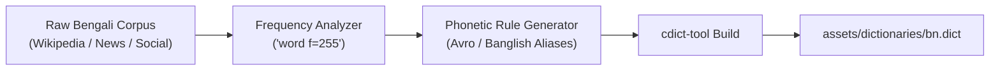
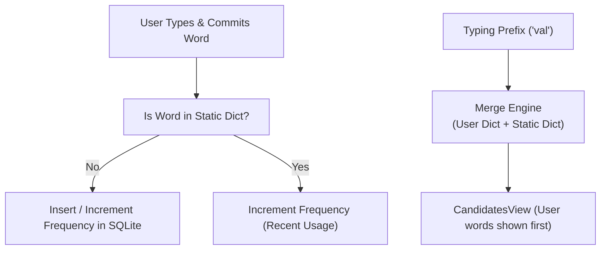
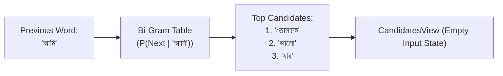
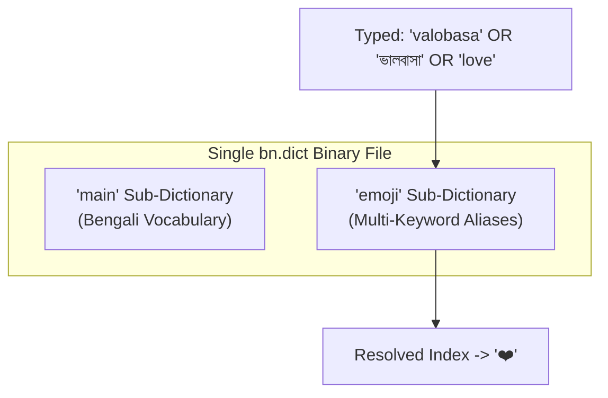

# Dictionary & Predictive Typing Development Guide

A comprehensive architectural and implementation guide for expanding the dictionary, user learning, next-word prediction, and multi-language emoji support in **OsthirKeyboard**.

---

## 1. Expand Bengali & Phonetic Dictionary (`bn.dict`)

### Core Concept
The dictionary engine (`libcdict`) relies on a compiled Acyclic Deterministic Finite Automaton (DFA) Trie. To provide accurate Bengali and phonetic (Banglish) suggestions, the dictionary source file must contain high-frequency Bengali vocabulary paired with frequency scores ($0 \le f \le 255$) and transliterated alias forms.



### Word List Format (`bangla_words.combined`)
```text
dictionary=main:bn,description=Comprehensive Bengali Vocabulary,locale=bn,date=1700000000,version=1
word=আমি,f=255
word=তুমি,f=240
word=ভালোবাসা,f=220
word=ভালবাসা,f=215
word=বাংলাদেশ,f=230
word=ধন্যবাদ,f=210
word=কেমন,f=200
word=আছো,f=195
```

### Sourcing Quality Wordlists:
1. **OpenBoard / Helium314 Bengali Dictionary**: Open-source AOSP-compatible wordlist.
2. **Bengali National Corpus / Ankur Bangla**: High-frequency root words and inflections.
3. **Phonetic Avro Dictionary (`avro-pad` dictionary tables)**: Contains phonetic English-to-Bangla word pairs (`ami` -> `আমি`, `tumi` -> `তুমি`).

### Build Command
```bash
cdict-tool build -o bn.dict main:bangla_words.combined
```

---

## 2. User Learning & Dynamic Personal Dictionary

### Core Concept
Static dictionaries cannot capture user contact names, local slang, or typing habits. A lightweight, on-device **Dynamic User Dictionary** records typed words and prioritizes them in `CandidatesView.java`.



### Recommended Architecture: SQLite / In-Memory Prefix Trie
1. **Database Schema (`UserDictionary.db`)**:
   ```sql
   CREATE TABLE user_words (
       id INTEGER PRIMARY KEY AUTOINCREMENT,
       word TEXT UNIQUE NOT NULL,
       frequency INTEGER DEFAULT 1,
       last_used_timestamp INTEGER
   );
   CREATE INDEX idx_user_words_prefix ON user_words(word);
   ```

2. **Integration Hook Points**:
   - **Capture**: In `KeyEventHandler.java` when `suggestion_entered()` or spacebar is pressed, record the committed token into `UserDictionaryDatabase`.
   - **Query & Merge**: In `Suggestions.java`:
     ```java
     // Query user dictionary first
     List<String> userMatches = UserDictionary.get(context).findByPrefix(word, 3);
     for (String w : userMatches) {
         suggestions[i++] = w; // Insert user words at highest priority
     }
     // Query static cdict dictionary for remaining slots
     ```
3. **Direct Boot & Privacy**:
   - Store the database in Device-Protected Storage (`Context.createDeviceProtectedStorageContext()`) so it functions before device PIN unlock without crashing.

---

## 3. Bi-Gram Next-Word Prediction (`NextWordPredictor.java`)

### Core Concept
Instead of predicting characters within the current word, **Next-Word Prediction** predicts the entire *next word* based on the preceding committed word ($P(W_{n} \mid W_{n-1})$).



### Data Structure: Bi-Gram Frequency Table
Create a compact binary table or SQLite transition table `(word1, word2, frequency)`:

| Previous Word ($W_{n-1}$) | Next Word ($W_n$) | Frequency |
| :--- | :--- | :--- |
| `আমি` | `তোমাকে` | 250 |
| `আমি` | `ভালো` | 220 |
| `কেমন` | `আছো` | 255 |
| `অনেক` | `ধন্যবাদ` | 240 |
| `শুভ` | `সকাল` | 245 |

### Implementation Blueprint in `NextWordPredictor.java`
```java
public class NextWordPredictor {
    private final Map<String, List<String>> _bigrams = new HashMap<>();

    public void load(Context context) {
        // Load pre-compiled bi-gram binary or database
    }

    public List<String> predictNextWords(String previousWord, int limit) {
        if (previousWord == null) return Collections.emptyList();
        String clean = previousWord.trim();
        List<String> matches = _bigrams.get(clean);
        return matches != null ? matches.subList(0, Math.min(matches.size(), limit)) : Collections.emptyList();
    }

    public void recordTransition(String word1, String word2) {
        // Increment transition frequency in user database
    }
}
```

### Triggering in `Keyboard2.java` / `Suggestions.java`:
- When spacebar is pressed and current input buffer is empty (`word == ""`), query `predictNextWords(lastCommittedWord, 3)`.
- Display predictions immediately in `CandidatesView`.

---

## 4. Bangla + Banglish Native Emoji Support in `bn.dict`

### Core Concept
Leverage `cdict-tool`'s native multi-dictionary packaging to pack an `"emoji"` sub-trie directly into `bn.dict`. This resolves English words, Banglish transliterations, and native Bengali scripts to the exact same Unicode emoji symbol.



### Step-by-Step Build Recipe:

#### 1. Define `bangla_emojis.combined`
```text
dictionary=Emojis:bn,description=Bangla Emoji Mapping,locale=bn,date=1700000000,version=1

word=love,f=14,not_a_word=true
 shortcut=❤️,f=14
word=valobasa,f=14,not_a_word=true
 shortcut=❤️,f=14
word=bhalobasha,f=14,not_a_word=true
 shortcut=❤️,f=14
word=ভালবাসা,f=14,not_a_word=true
 shortcut=❤️,f=14
word=ভালোবাসা,f=14,not_a_word=true
 shortcut=❤️,f=14
word=prem,f=14,not_a_word=true
 shortcut=❤️,f=14
word=প্রেম,f=14,not_a_word=true
 shortcut=❤️,f=14

word=hasi,f=14,not_a_word=true
 shortcut=😂,f=14
word=হাসি,f=14,not_a_word=true
 shortcut=😂,f=14

word=agun,f=14,not_a_word=true
 shortcut=🔥,f=14
word=আগুন,f=14,not_a_word=true
 shortcut=🔥,f=14
word=osthir,f=14,not_a_word=true
 shortcut=🔥,f=14
 shortcut=😎,f=14
word=অস্থির,f=14,not_a_word=true
 shortcut=🔥,f=14
 shortcut=😎,f=14
```

#### 2. Compile with `cdict-tool`
```bash
cdict-tool build -o bn.dict \
    main:bangla_words.combined \
    emoji:bangla_emojis.combined
```

#### 3. Place in App Assets
Copy the compiled `bn.dict` to:
```text
srcs/../assets/dictionaries/bn.dict
```

When loaded in the app:
- `_config.current_dictionary` points to `main` (autocomplete words).
- `_config.emoji_dictionary` points to `emoji` (triggers emoji suggestions).

---

## 5. Summary Checklist for Future Implementation

| Phase | Milestone | Key Classes / Files |
| :--- | :--- | :--- |
| **Phase 1** | Build enriched `bn.dict` with `main` words and `emoji` aliases | `assets/dictionaries/bn.dict`, `cdict-tool` |
| **Phase 2** | Create on-device SQLite User Learning database | `srcs/.../dict/UserDictionaryDatabase.java`, `Suggestions.java` |
| **Phase 3** | Implement Bi-Gram Next-Word Predictor | `srcs/.../suggestions/NextWordPredictor.java`, `CandidatesView.java` |
| **Phase 4** | Merge User Words + Next-Word + Static Dictionary into Candidate Bar | `CandidatesView.java`, `KeyEventHandler.java` |
