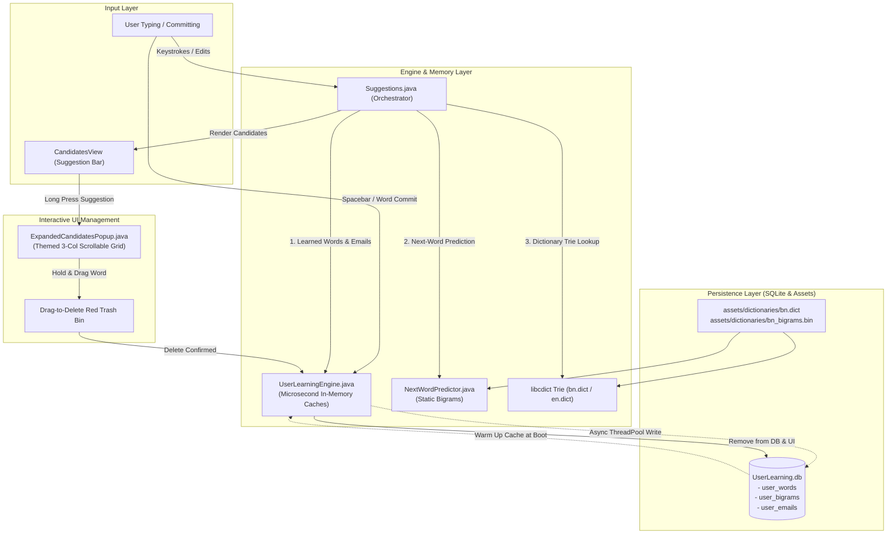
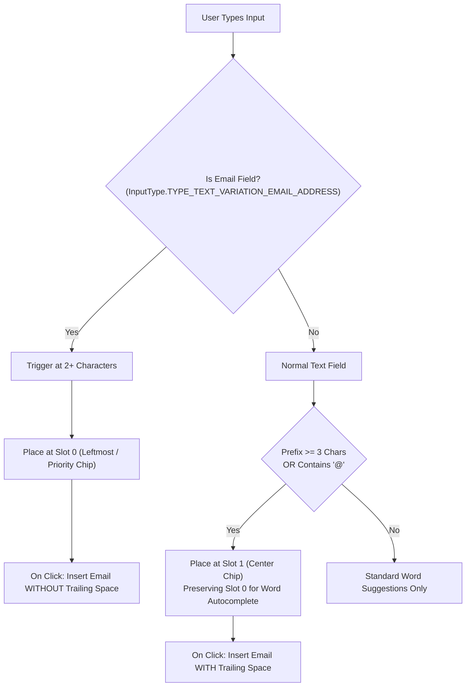
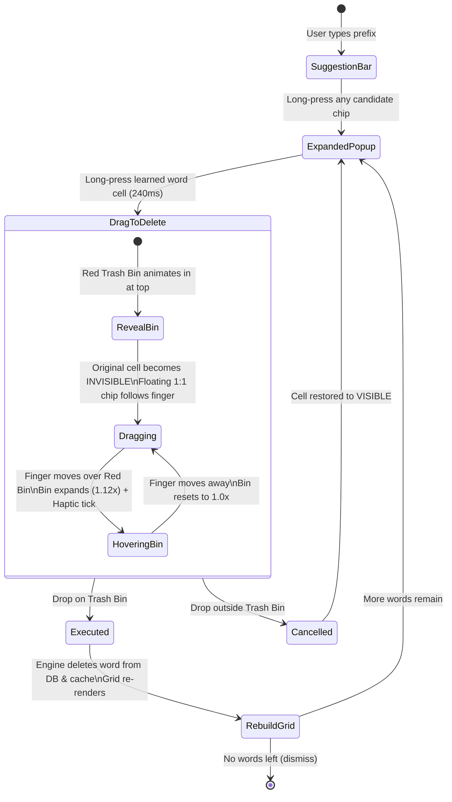

# Dictionary, User Learning & Suggestions Architectural Guide

A comprehensive architectural and implementation guide for the dictionary engine, on-device user learning, frequency-ranked word suggestion, smart email detection, next-word prediction, and expanded candidates popup with drag-to-delete in **OsthirKeyboard**.

---

## Architecture Overview



---

## 1. Frequently Used Words & Frequency Ranking

### Core Concept
The user's personal typing habits, slang, names, and contact handles evolve over time. Instead of relying purely on a static dictionary, **OsthirKeyboard** maintains a high-performance, on-device personal learning engine (`UserLearningEngine.java`) backed by SQLite (`UserLearningDatabase.java`).

Every time a word is typed, accepted via suggestion, or committed with a space, its frequency counter is incremented. Higher-frequency words automatically rise to the top of suggestions, taking precedence over standard dictionary words.

### Database Schema (`user_words` & `user_bigrams`)
Managed in `UserLearningDatabase.java` (`UserLearning.db`):

```sql
-- Individual learned words
CREATE TABLE IF NOT EXISTS user_words (
    id INTEGER PRIMARY KEY AUTOINCREMENT,
    word TEXT UNIQUE NOT NULL,
    frequency INTEGER DEFAULT 1,
    last_used INTEGER
);
CREATE INDEX IF NOT EXISTS idx_user_words_word ON user_words(word);

-- Word transition pairs (W1 -> W2)
CREATE TABLE IF NOT EXISTS user_bigrams (
    id INTEGER PRIMARY KEY AUTOINCREMENT,
    w1 TEXT NOT NULL,
    w2 TEXT NOT NULL,
    frequency INTEGER DEFAULT 1,
    last_used INTEGER,
    UNIQUE(w1, w2)
);
CREATE INDEX IF NOT EXISTS idx_user_bigrams_w1 ON user_bigrams(w1);
```

### Zero-Latency In-Memory Caching (`UserLearningEngine.java`)
Direct SQLite queries on every keystroke introduce UI stutter. `UserLearningEngine` avoids this with thread-safe, concurrent in-memory caches:
- `_wordFrequencyCache`: `ConcurrentHashMap<String, Integer>` storing `word -> frequency`.
- `_bigramCache`: `ConcurrentHashMap<String, Map<String, Integer>>` storing `w1 -> {w2 -> frequency}`.
- Asynchronous database writes executed on a background single-thread executor (`Executors.newSingleThreadExecutor()`).

### Frequency Sorting Algorithm
When querying prefix completions in `UserLearningEngine.get_word_completions(prefix, maxCount)`:
1. **Exact Matches First**: If the user has typed the full word before, it takes highest precedence.
2. **Frequency Descending (`frequency DESC`)**: The most frequently typed words are placed first.
3. **Word Length (`length ASC`)**: Shorter completions are favored over long compounds for the same frequency.
4. **Recency (`last_used DESC`)**: When frequencies are identical, the most recently used word is prioritized.

```java
candidates.sort((a, b) -> {
    boolean aExact = a.getKey().equalsIgnoreCase(p);
    boolean bExact = b.getKey().equalsIgnoreCase(p);
    if (aExact != bExact) return aExact ? -1 : 1;
    int cmp = Integer.compare(b.getValue(), a.getValue());
    if (cmp != 0) return cmp;
    return Integer.compare(a.getKey().length(), b.getKey().length());
});
```

---

## 2. Smart Email Suggestion & Learning System

### Core Concept
Typing full email addresses on a mobile keyboard is repetitive and prone to typos. The keyboard automatically learns valid email addresses as the user enters them, stores them in an indexed table, and contextually presents them as suggestions.



### Database Schema (`user_emails`)
```sql
CREATE TABLE IF NOT EXISTS user_emails (
    id INTEGER PRIMARY KEY AUTOINCREMENT,
    email TEXT UNIQUE NOT NULL,
    username TEXT NOT NULL,
    domain TEXT NOT NULL,
    frequency INTEGER DEFAULT 1,
    last_used INTEGER
);
CREATE INDEX IF NOT EXISTS idx_user_emails_username ON user_emails(username);
CREATE INDEX IF NOT EXISTS idx_user_emails_email ON user_emails(email);
```

### Learning & Sanitization Logic
- **Detection**: Strings containing `@` with characters before and a dot after (e.g. `sohan@gmail.com`) are recognized by `CandidatesView.is_email_string(str)` and recorded via `UserLearningEngine.record_email(email)`.
- **Pollution Prevention**: Email strings are blocked from entering `user_words` (`word.contains("@")` is rejected) to avoid corrupting standard word predictions. Corrupted entries with `@` in `user_words` are cleaned up automatically via `cleanupCorruptedUserWords()`.

### Context-Aware Placement in `Suggestions.java`:
1. **Email Input Fields (`EditorInfo.is_email_field`)**:
   - Triggers when typing 2 or more characters.
   - Inserted at **Slot 0** (the primary leftmost suggestion).
   - When selected, **no trailing space** is appended (`insertion = word`), preventing unwanted trailing spaces in form fields.
2. **Normal Text Fields (Chat, Notes, Web)**:
   - Triggers when typing 3 or more characters or as soon as `@` is typed.
   - Inserted gracefully at **Slot 1** (the center suggestion chip) so Slot 0 remains dedicated to normal vocabulary autocomplete.
   - When selected, a **trailing space** is appended (`insertion = word + " "`) for fluid sentence typing.

---

## 3. Bi-Gram Next-Word Prediction

### Core Concept
Predicts the entire subsequent word based on the previous committed word ($P(W_{n} \mid W_{n-1})$).

### Dual-Layer Prediction Strategy:
1. **Layer 1: Personalized Learned Transitions**:
   - Pulled from `UserLearningEngine.get_next_word_predictions(w1, 3)`.
   - Captures user-specific phrases (e.g., `Sohan` $\rightarrow$ `Ahmed`, `আমার` $\rightarrow$ `নাম`).
2. **Layer 2: Static Compiled Language Model**:
   - Loaded from `assets/dictionaries/bn_bigrams.bin` via `NextWordPredictor.java`.
   - Delivers general conversational bi-grams (e.g., `কেমন` $\rightarrow$ `আছো`, `অনেক` $\rightarrow$ `ধন্যবাদ`).

### Sentence Boundary Suppression
To avoid unnatural suggestions across sentences, prediction is automatically suppressed when the previous token ends with sentence delimiters:
- Bengali Dari: `।` (`\u0964`), Double Dari: `॥` (`\u0965`)
- Full stop: `.`
- Question mark: `?`
- Exclamation mark: `!`
- Newlines / Carriage returns: `\n`, `\r`

---

## 4. Expanded Candidates Popup & Drag-to-Delete

### Core Concept
When a user long-presses any word suggestion in `CandidatesView`, the keyboard opens an **Expanded Candidates Popup** (`ExpandedCandidatesPopup.java`). This popup displays all available suggestions in an intuitive 3-column scrollable grid and provides an interactive gesture to delete unwanted learned words, mistyped transitions, or emails.



### Visual & Interactive Features
1. **Theme Harmonization**:
   - Uses active keyboard theme attributes (`R.attr.colorKeyboard`, `R.attr.colorKey`, `R.attr.colorKeyActivated`, `R.attr.colorLabel`, `R.attr.keyBorderRadius`).
   - Adapts to dark/light modes with semi-transparent border strokes and ripple drawables.
2. **Compact Dimensions**:
   - Constrained to ~35% smaller footprint than standard popups (~155dp scroll container) to keep keyboard context visible.
   - Smooth vertical scrolling enabled when candidates exceed 12 items (4 rows).
3. **Ghost-Free Dragging**:
   - When drag starts, the original grid cell is set to `View.INVISIBLE` so no ghost text stays behind the floating chip.
   - If cancelled, the cell transitions back to `View.VISIBLE` with an alpha fade.
4. **Leak-Free ViewPropertyAnimator Lifecycle**:
   - All animations on the Red Trash Bin (`_binZone`, `_binContainer`) explicitly call `.setListener(null)` before and after transitions. This prevents hide listeners from lingering and prematurely dismissing the bin on subsequent drag attempts.
5. **Protected Built-In Dictionary**:
   - Long-pressing a static dictionary word displays a friendly notification: *"Built-in dictionary words cannot be deleted"*.
   - Only user-learned entries (in `user_words`, `user_bigrams`, or `user_emails`) can be deleted.

---

## 5. Bengali & Phonetic Dictionary Compilation (`bn.dict`)

### Word List Format (`bangla_words.combined`)
Compiled into an Acyclic DFA Trie using `cdict-tool`:

```text
dictionary=main:bn,description=Comprehensive Bengali Vocabulary,locale=bn,date=1700000000,version=1
word=আমি,f=255
word=তুমি,f=240
word=ভালোবাসা,f=220
word=বাংলাদেশ,f=230
word=ধন্যবাদ,f=210
word=কেমন,f=200
word=আছো,f=195
```

### Multi-Dictionary Emoji Sub-Trie (`bangla_emojis.combined`)
Packages bilingual and phonetic emoji keywords directly into `bn.dict`:

```text
dictionary=Emojis:bn,description=Bangla Emoji Mapping,locale=bn,date=1700000000,version=1
word=love,f=14,not_a_word=true
 shortcut=❤️,f=14
word=valobasa,f=14,not_a_word=true
 shortcut=❤️,f=14
word=ভালবাসা,f=14,not_a_word=true
 shortcut=❤️,f=14
word=hasi,f=14,not_a_word=true
 shortcut=😂,f=14
word=osthir,f=14,not_a_word=true
 shortcut=🔥,f=14
 shortcut=😎,f=14
```

### Build Command
```bash
cdict-tool build -o bn.dict \
    main:bangla_words.combined \
    emoji:bangla_emojis.combined
```

---

## 6. Implementation Status & Component Reference

| Component | File / Class | Status | Description |
| :--- | :--- | :---: | :--- |
| **SQLite Storage** | `UserLearningDatabase.java` | ✅ Complete | Manages `user_words`, `user_bigrams`, and `user_emails` tables with indexes and CRUD. |
| **Engine & Cache** | `UserLearningEngine.java` | ✅ Complete | Zero-latency in-memory maps, async background writes, frequency-sorted query APIs. |
| **Suggestion Orchestrator** | `Suggestions.java` | ✅ Complete | Merges user learning, contextual email placement, bigram predictions, and static dictionary. |
| **Candidate Bar UI** | `CandidatesView.java` | ✅ Complete | Horizontal suggestion chip bar, long-press detection, email formatting, and action bar. |
| **Expanded Popup** | `ExpandedCandidatesPopup.java` | ✅ Complete | Compact 3-col grid, dynamic theme styling, drag-to-delete Red Bin with haptics. |
| **Next-Word Predictor** | `NextWordPredictor.java` | ✅ Complete | Static language bigram binary lookup (`bn_bigrams.bin`) with sentence boundary checks. |
| **Static Dictionary** | `assets/dictionaries/bn.dict` | ✅ Complete | Binary DFA Trie containing base Bengali vocabulary and emoji shortcuts. |
